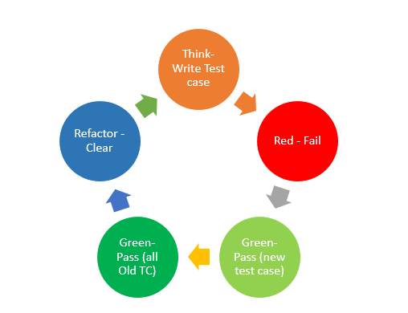

# Test Driven Development

Test-driven development (TDD) is a software development process that relies on the repetition of a very short development cycle.Requirements are turned into very specific test cases. Then the code is improved so that the tests pass. The cycle repeats.

[Reference](https://en.wikipedia.org/wiki/Test-driven_development)

## Testing – Traditional Model
https://docs.microsoft.com/en-us/visualstudio/cross-platform/tools-for-cordova/debug-test/test-driven-development?view=toolsforcordova-2017#test-driven-development
https://www.tutorialspoint.com/software_testing_dictionary/code_driven_testing.htm

<!---->

Developers who define their role as “writing code” usually jump right into writing methods that handle different kinds of data that might get thrown at them\.

Then they write tests\. After writing a few tests\, they’ll see that some of those tests still fail because of certain code cases that their methods can’t handle\. They improve those methods to handle those cases\, and write a few more tests\, which then reveal _additional_ issues in the unit code\.

This puts them into a pattern of bouncing back and forth between thinking about coding and thinking about data for test cases\.

This results in missed test cases and faulty code\.

## TDD – Test Driven Development
https://docs.microsoft.com/en-us/visualstudio/cross-platform/tools-for-cordova/debug-test/test-driven-development?view=toolsforcordova-2017#test-driven-development

* Testing is just as important as coding\, if not more so\.
* Thinking through variations of good and bad data is a _different mental process_ than thinking about how to handle those variations in code\.
  * TTD asks\, “How do I challenge the unit under test to fail?”
  * “Coding” asks “How do I write this method to work properly?”

## TDD – Test Driven Development
https://www.whizlabs.com/blog/what-is-tdd-and-its-phases/

  * _Create a test case_ \-Write a test case before writing  any code\. This ensures you write the test to a methods expected functionality and the test case is not biased to show code merely works\.
  * _Red_  _Failure of test case_ \- There’s no code\. You get a compile error\.
  * _Green_ – Write code so the new test case to passes\. Write only the minimum required to pass the test case\. The “just enough” concept helps ensure that no extra bit of code goes in\.
  * _Green_ \-Ensure all old test cases still pass\.
  * _Refactor the code to clean it_ \-Ensure that all functionality is intact and the code is refined\.
* Repeat the cycle\.

## Unit Testing
https://docs.microsoft.com/en-us/visualstudio/test/unit-test-basics?view=vs-2019

It's called _unit_ testing because you break down the functionality of your program into discrete testable behaviors that you can test as individual _units_ \.

Use a _unit_ testing framework to create _unit_ tests\, run them\, and report the results of these tests\.

Rerun _unit_ tests when you make changes to test that your code is still working correctly\. _Unit_ testing has the greatest effect on the quality of your code when it's an integral part of your software development workflow\.

## Unit Testing
https://docs.microsoft.com/en-us/dotnet/core/testing/
https://docs.microsoft.com/en-us/dotnet/core/testing/#what-are-unit-tests
https://docs.microsoft.com/en-us/visualstudio/test/unit-test-basics?view=vs-2019

Automated tests are a great way to ensure an application does what’s intended\. There are multiple types of tests \( _integration_ tests\, _web_ tests\, _load_ tests\)\.

* _Unit_ tests:
  * primarily test methods\.
  * should _only_ test code within the developer’s control\.
  * should not test infrastructure concerns \(databases\, file systems\, network resources\)\.

